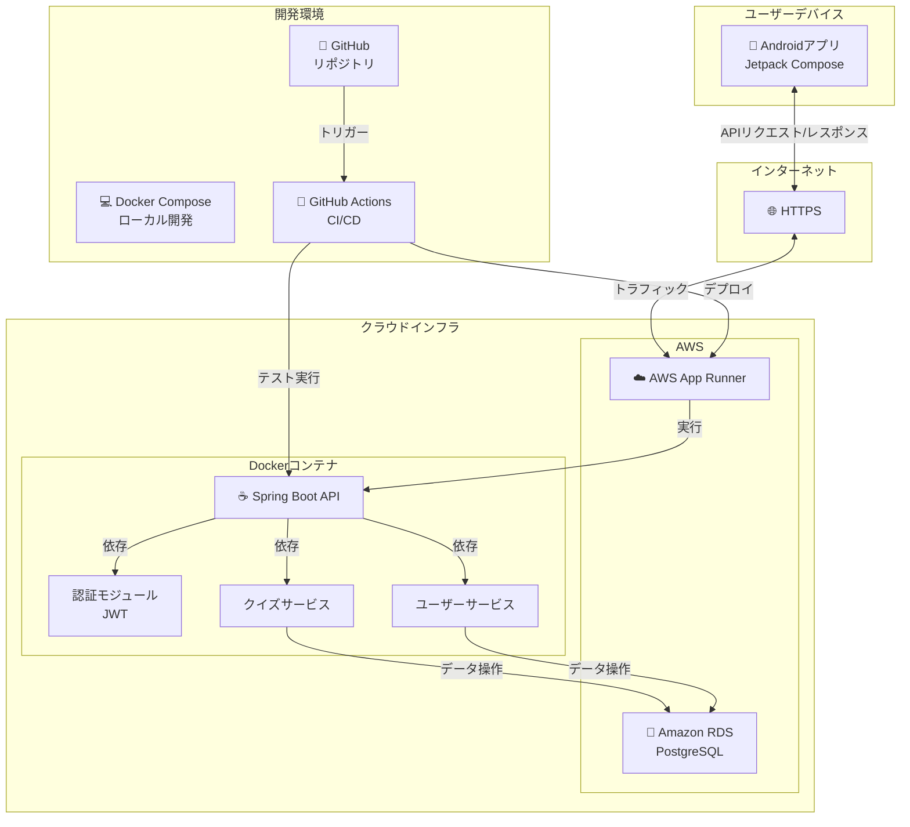

# クイズAPI - バックエンド開発ポートフォリオ

## 📝 プロジェクト概要

本プロジェクトは、Spring Bootを使用して開発されたRESTful APIサーバーです。プログラミング知識を測定するためのクイズアプリケーションのバックエンドとして機能し、フロントエンドのAndroidアプリケーションにデータを提供します。

### 主な機能

- クイズデータの管理・提供
- ユーザー認証（JWT認証）
- クイズ回答履歴の記録
- ユーザープロフィール管理
- OpenAPI（Swagger）によるAPI仕様の自動ドキュメント化

## 🛠️ 技術スタック

### バックエンド

- **言語:** Java 17
- **フレームワーク:** Spring Boot 3.5.0
- **API:** RESTful API (JSON)
- **データベース:** PostgreSQL
- **ORM:** Spring Data JPA
- **マイグレーション:** Flyway
- **認証:** Spring Security + JWT
- **ドキュメント:** SpringDoc OpenAPI (Swagger)
- **テスト:** JUnit, Spring Test

### インフラ

- **コンテナ化:** Docker / Docker Compose
- **CI/CD:** GitHub Actions
- **デプロイ:** AWS App Runner
- **データベースホスティング:** Amazon RDS for PostgreSQL

## 📋 システムアーキテクチャ

本アプリケーションは、マイクロサービスの考え方を取り入れた3層アーキテクチャで構築されています：

1. **プレゼンテーション層 (Controller)** - REST APIエンドポイントを公開
2. **ビジネスロジック層 (Service)** - アプリケーションの主要なロジックを実装
3. **データアクセス層 (Repository)** - データベースとのインタラクションを管理



## 🚀 セットアップ方法

### 前提条件

- Docker と Docker Compose がインストールされていること
- Java 17 (Docker環境内で使用)
- Gradleビルドツール (Docker環境内で使用)

### ローカル開発環境の起動

```bash
# リポジトリのクローン
git clone https://github.com/yourusername/quiz-api.git
cd quiz-api

# Docker Composeでアプリケーションとデータベースを起動
docker-compose up
```

アプリケーションは http://localhost:8080 で利用可能になります。
API仕様書は http://localhost:8080/swagger-ui.html で確認できます。

## 📚 API仕様

### 主要エンドポイント

| メソッド | エンドポイント | 説明 | 認証要否 |
|---------|----------------|------|----------|
| GET | /api/v1/quizzes | クイズ一覧を取得 | 必要 |
| GET | /api/v1/quizzes/{id} | 特定のクイズを取得 | 必要 |
| POST | /api/v1/auth/register | ユーザー登録 | 不要 |
| POST | /api/v1/auth/login | ログイン | 不要 |

詳細なAPI仕様は、アプリケーション起動後にSwagger UIで確認できます。

## 🧪 テスト

```bash
# テストの実行
./gradlew test
```

## 🏗️ CI/CD

GitHub Actionsを使用して、以下の自動化を実現しています：

1. コードのプッシュ時に自動テスト実行
2. mainブランチへのマージ時に自動デプロイ

## 📈 将来の展望

- カテゴリー別クイズ取得機能の追加
- ユーザーランキングシステムの実装
- パフォーマンス分析ダッシュボードの開発
- 多言語対応

## 👨‍💻 プロジェクト特長（採用担当者様向け）

- **クリーンアーキテクチャ**: 責務を明確に分離し、テスト容易性と保守性を高めています
- **セキュリティ対策**: JWT認証、入力バリデーション、適切なエラーハンドリングを実装
- **ドキュメント化**: OpenAPIを活用した自動API仕様生成
- **コンテナ化**: Docker/Docker Composeによる環境の一貫性確保
- **CI/CD**: GitHub Actionsを用いた継続的インテグレーション/デリバリー
- **クラウドネイティブ**: AWSサービスを活用したスケーラブルな設計

## 📄 ライセンス

ライセンス MIT
